# RSENSE20_ANGOSTO_P4

Desarrollado para la arduino IDE
Repositorio para la práctica P4 de redes de sensores.

## Programa base:
Commit 0fd2ed84.

Conexión a red Wifi RSESENSE20_ANGOSTO_P4, se envía por puerto serie la IP. PING a www.google.com y envío de tiempo medio por puerto serie.
### Montaje
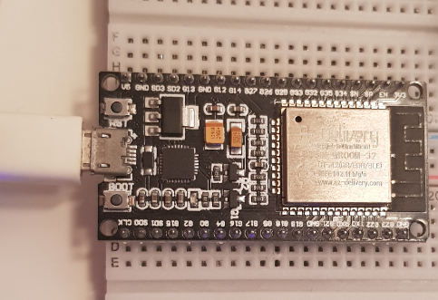

### Hiperterminal con datos del ping.
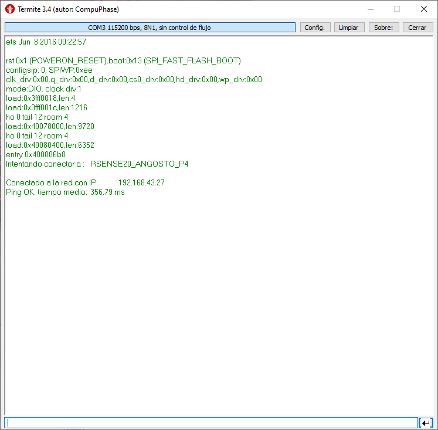

## Punto 2: Obtencion de hora desde servidor NTP.
Commit 75387348.

Conexión a red Wifi RSESENSE20_ANGOSTO_P4, se envía por puerto serie la IP. A través de servidor NTP se obtiene la hora y se envía cada segundo por puerto serie.
### Hiperterminal con datos del NTP.
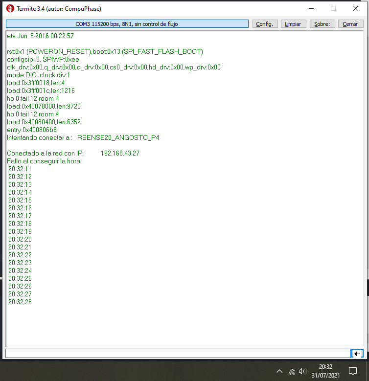

## Punto 3: Comunicación por TCP.
Commit e5fc11e8.

Usando Socket Test se prepara un servidor y cliente en el mismo equipo comoo prueba de funcinanmiento.
### Dos instancias de Socket test conmunicandose.
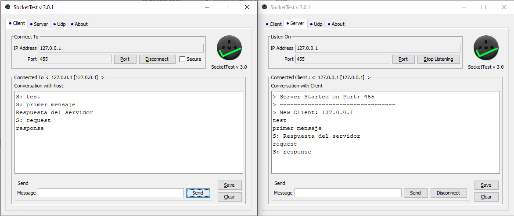

## Punto 4: Comunicación por TCP desde ESP32.
Commit 1a3486ad.

Usando Socket Test se prepara un servidor para envíar la hora cada segundo, también se envía por puerte serie. En el ESP2 se configura la IP del equipo y en SocketTest se configura como 0.0.0.0 para que funcione. Se usa el puerto 455.
### Hiperterminal y socketTest con datos del NTP.
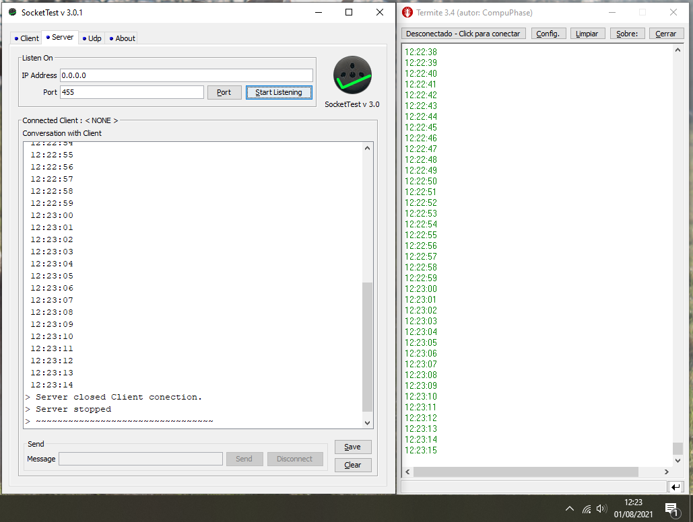

## Punto 5:  Comunicación bidirecctional por TCP con ESP32.
Commit c3c892cc.

Partiendo del commit 1a3486ad se implementan los comandos start y stop para el paro o reanudación del envío de mensajes.
### Hiperterminal y socketTest con datos del NTP y comandos.


## Punto 6:  Servidor Web que muestra la hora y  cuenta con botón de reinicar la hora.
Commit b25d6b32.

Servidor web con visualización de la hora, es necesario refrescar la web para mantener el relo en hora, y cuenta con botón para setear en 00:00:00.

Por pueto serie se manda la IP a usar para conectarte, y el sudominio web solicitado.
### Página web e hiperteminal en diferentes momentos.
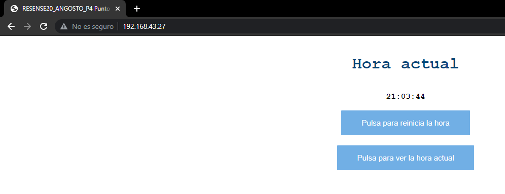
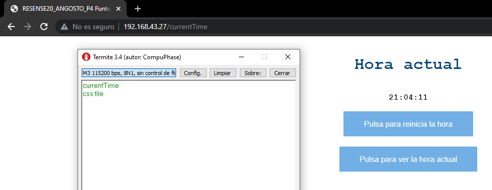
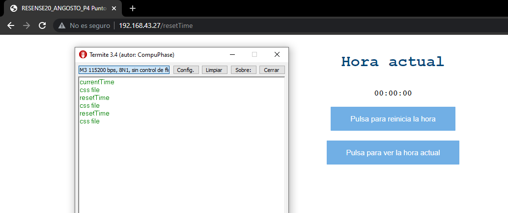
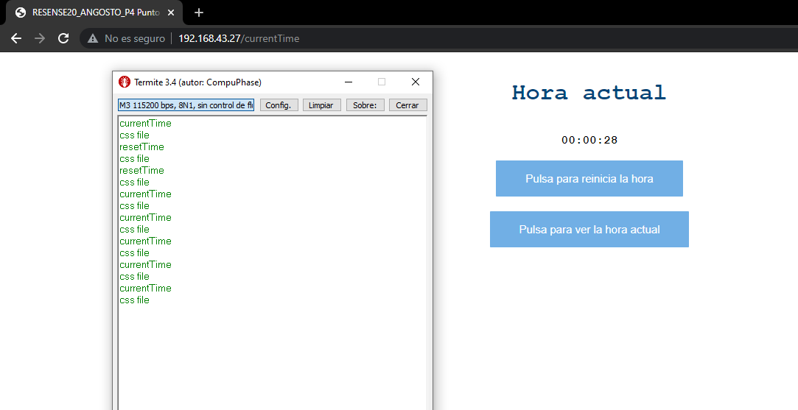

## Punto 7: Fichero JSON subido a servidor FTP.
Commit afe24932.

El servidor FTP se configura en Filezilla, para ello se escoge la IP 127.0.0.1 y el puerto 14147. Después es necesario dar de alta un nuevo usuario con el ID y contraseña que se configuren en el programa de Arduino. Además se escoge el directorio de la práctica como directorio raíz, y se habilitan todos los permisos relacionados con la gestión de archivos.

### Captura de la configuración de FileZilla.
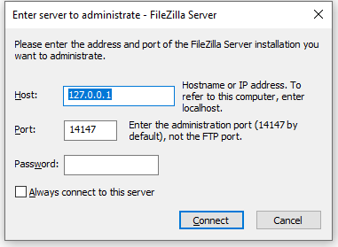
### Captura de archivos generados y contenido de uno de ellos.
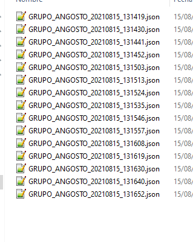

```json
{"v":[23,27,22,25,20,26,28,26,25,26,24,23,22,29,27,21,20,28,26,22,22,21,27,28,21,25,24,24,21,23],"t":[131452,131452,131452,131452,131452,131452,131452,131452,131452,131452,131452,131452,131452,131452,131452,131452,131452,131452,131452,131452,131452,131452,131452,131452,131452,131452,131452,131452,131452,131452]}
```
---
## Bibliografía:
* [Arduino core for the ESP32](https://github.com/espressif/arduino-esp32)
* [Espressif API reference](https://docs.espressif.com/projects/esp-idf/en/latest/esp32/api-reference/index.html).
* [Sockect test](http://sockettest.sourceforge.net/)
* [Ejemplo servidor web](https://randomnerdtutorials.com/esp32-web-server-spiffs-spi-flash-file-system/)
* [Instalación carga archivos para SPIFFS desde arduino IDE](https://randomnerdtutorials.com/install-esp32-filesystem-uploader-arduino-ide/)
## Librerías de terceros:
* [ESP32 ping library](https://github.com/marian-craciunescu/ESP32Ping)
    * Usa el protocolo a nivel de red ICMP.
---
David Angosto Latorre, 633706
